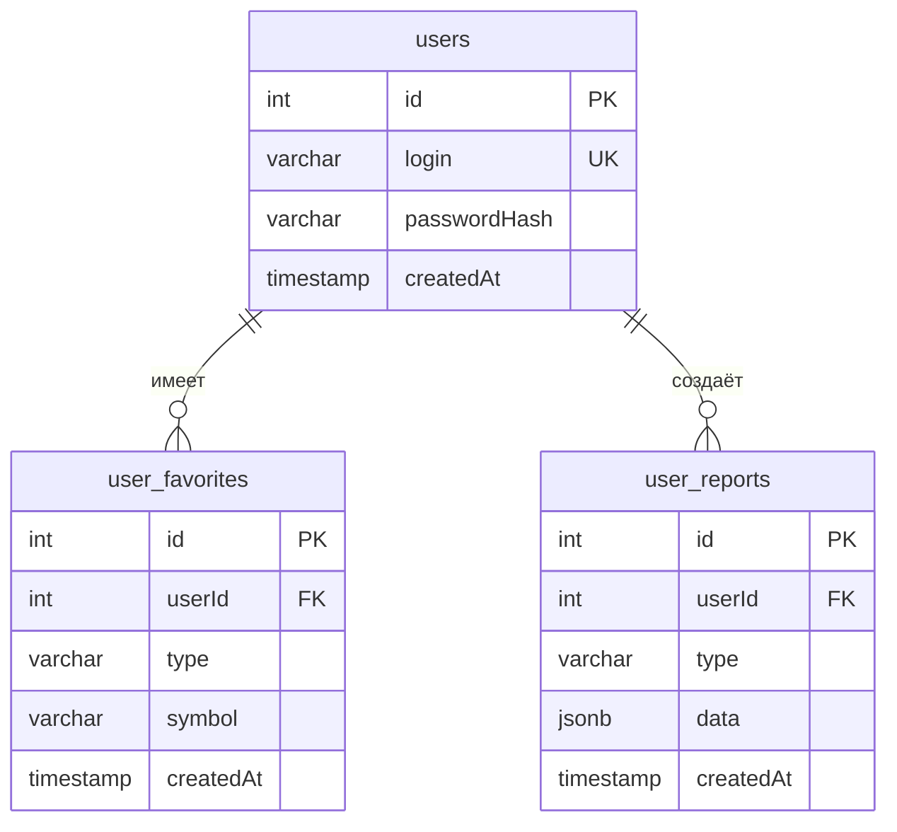

# Схема БД FinDash

Документация структуры базы данных: таблицы, связи, ограничения и индексы.

---

## ER-диаграмма

---

## Таблицы и поля

### users

| Поле          | Тип        | Ограничения |
|---------------|------------|-------------|
| `id`          | SERIAL     | PRIMARY KEY |
| `login`       | VARCHAR(255) | UNIQUE, NOT NULL |
| `passwordHash`| VARCHAR(255) | NOT NULL |
| `createdAt`   | TIMESTAMP  | DEFAULT NOW |

### user_favorites

| Поле       | Тип        | Ограничения |
|------------|------------|-------------|
| `id`       | SERIAL     | PRIMARY KEY |
| `userId`   | INTEGER    | NOT NULL, FK → users(id) ON DELETE CASCADE |
| `type`     | VARCHAR(50) | NOT NULL, CHECK IN ('currency', 'stock', 'bond') |
| `symbol`   | VARCHAR(50) | NOT NULL |
| `createdAt`| TIMESTAMP  | DEFAULT NOW |

Уникальность: один пользователь не может дважды добавить один и тот же актив — **UNIQUE(userId, type, symbol)**.

### user_reports

| Поле       | Тип         | Ограничения |
|------------|-------------|-------------|
| `id`       | SERIAL      | PRIMARY KEY |
| `userId`   | INTEGER     | NOT NULL, FK → users(id) ON DELETE CASCADE |
| `type`     | VARCHAR(100)| NOT NULL |
| `data`     | JSONB       | NOT NULL |
| `createdAt`| TIMESTAMP   | DEFAULT NOW |

---

## Связи

- **users → user_favorites** — один пользователь, много записей избранного. При удалении пользователя все его избранные записи удаляются (CASCADE).
- **users → user_reports** — один пользователь, много отчётов. При удалении пользователя все его отчёты удаляются (CASCADE).

---

## Типы активов (user_favorites.type)

| type       | Описание     | Примеры символов |
|------------|--------------|-------------------|
| `bond`     | Облигации    | ОФЗ 26238, СУ-35001 |
| `stock`    | Акции        | SBER, GAZP, YNDX, LKOH |
| `currency` | Криптовалюты | BTC, ETH, USDT, TON |

---

## Индексы

| Таблица          | Индекс | Поля | Зачем |
|------------------|--------|------|--------|
| users            | idx_users_login | login | Поиск по логину при входе |
| user_favorites   | idx_user_favorites_userId | userId | Все избранные пользователя |
| user_favorites   | idx_user_favorites_type | type | Фильтр по типу актива |
| user_favorites   | idx_user_favorites_userId_type | userId, type | Избранное по типу (только облигации и т.д.) |
| user_reports     | idx_user_reports_userId | userId | Отчёты пользователя |
| user_reports     | idx_user_reports_type | type | Фильтр по типу отчёта |
| user_reports     | idx_user_reports_createdAt | createdAt | Сортировка по дате |
| user_reports     | idx_user_reports_userId_createdAt | userId, createdAt DESC | Отчёты пользователя по дате |

Все индексы создаются в `bd.sql`; отдельный скрипт — `indexes.sql`.
